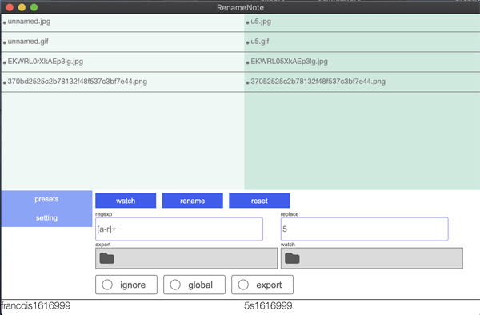
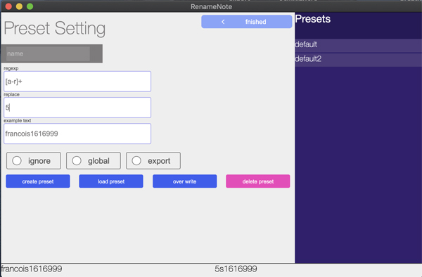

# Electron rename app RenameNote

[Japanese explanation is here](https://kawano-shuji.com/justdiary)

this app renames a lot of file through regexp  
write regexp and replace word , and drag and drop files you want to rename , and than it renames a lot of file.  
even it can save your preset and load it next time. watching directory you selected and rename file you dropped automatically.  
more details are below

;    

;    

basic feauture is drag and drop file on main form directory. and it will be added on list.
write regexp and replace word , select options. you can check original filename and result of rename on list.
if the app found same result after renamed , it cautions through labeling red on list.
you can also save preset and load it. 
some other options and features are see below lists

## main feature

1. export  move file after rename it.
2. watch  watch directory you selected and it detects after put file in directory.

## preset data

1. name preset's name
2. regexp 
3. replace words
4. ignore case
5. global
6. export option whether move file or not , after rename it
7. example text

## how to use it

clone this repository and type it below

```
 npm i  
 npm start 
```

even you can package it
```
 npm run pack
```
## **warning**

it was developed on Mac OS. it might not work on Windows.
in case , please try it below

```
npm i -f
```
